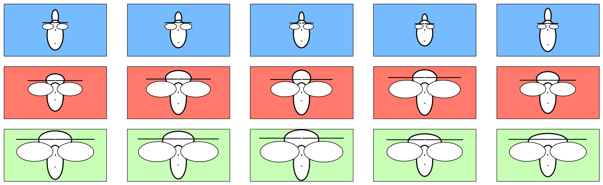

# Chernoff Faces: Iris Visualization

Данный репозиторий содержит инструменты для визуализации многомерных данных с использованием лиц Чернова (Chernoff Faces). В качестве демонстрации приведен пример на основе классического набора данных "Ирисы" (Iris dataset).

## Содержимое

1. `iris_visualization.py`: Скрипт для загрузки датасета Iris и его визуализации с помощью Chernoff Faces.
2. `chernov_faces.py`: Библиотека функций для создания и отображения Chernoff Faces.

## Установка и библиотеки

Для работы скриптов потребуются следующие библиотеки:

- numpy
- pandas
- matplotlib
- scikit-learn

Вы можете установить все зависимости сразу, используя следующую команду:

```bash
pip install numpy pandas matplotlib scikit-learn
```

## Использование

1. Клонируйте репозиторий на ваш локальный компьютер:

```bash
git clone https://github.com/ilyhav/chernoff-faces.git
cd chernoff-faces
```

2. Запустите скрипт `iris_visualization.py`:

```bash
python iris_visualization.py
```

После выполнения команды, визуализация Chernoff Faces для датасета Iris появится на экране. Для визуализации каждого из четырех параметров цветка ириса (длина лепестка, ширина лепестка, длина чашелистика, ширина чашелистика) отображается на определенную характеристику лица Чернова. Это позволяет наглядно сравнивать различные образцы и выявлять закономерности в данных.

Вариант 1:


Вариант 2:



## Лицензия

Данный проект лицензирован по лицензии MIT - подробности см. в файле [LICENSE](LICENSE).
